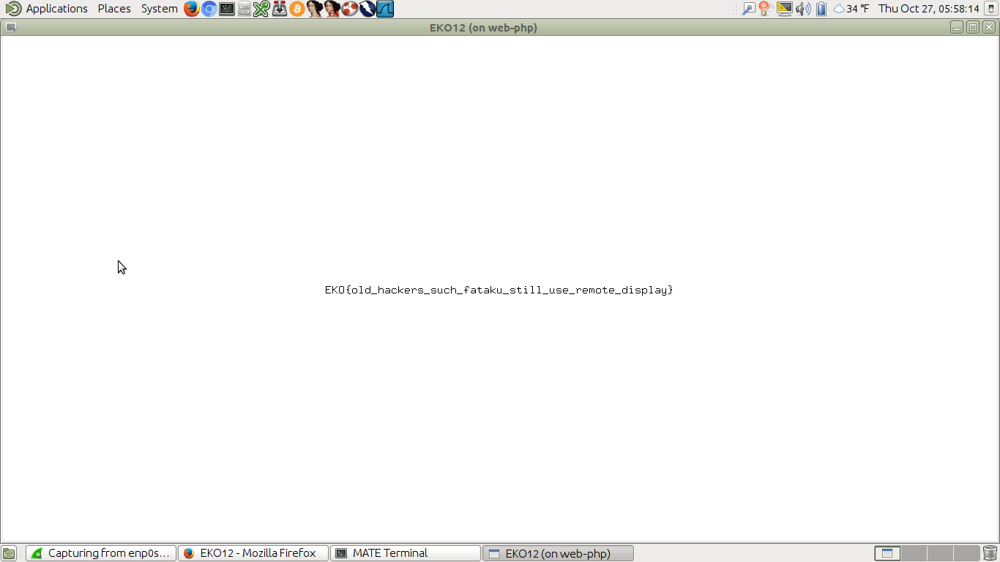

# X-Flag - Misc 150

```
Can you see the flag?

http://f50bf71fa6dbc43f48fbb7e6ac749e4a7099b053.ctf.site:20000/
```

This one is a webapp that asks us to input an IP address to where the flag will be sent. So we'll have to get out in front of whatever NAT we're behind so that we have a legit address on the open Internet.

I first tried just running `tcpdump` on the JunOS machine I've got downstairs. JunOS is based on FreeBSD, so it's similar to Linux but sort-of two steps removed. I couldn't figure out which interface to use quick enough (there are a lot), so I dropped it and just went downstairs and plugged my laptop straight into the 'net. There's nothing like raw Internet, straight to the dome...

I went back to the web interface and requested the flag be sent to me. A SYN was sent to port 6000, (X11 remote desktop - old skool) so I punched a hole in my firewall (`sudo iptables -I INPUT 1 -p tcp --dport 6000 -j ACCEPT`) and stood up netcat (`nc -ll 6000`) as a quick-and-dirty way to accept connections. I requested the flag again. This time, a connection was made over port 6000, and Wireshark even recognized the incoming traffic as belonging to the X11 protocol. No flag, though. So I'll have to scratch netcat and actually stand up an X server, old skool. (This is all on Ubuntu 16.04 by the way.)

I hopped over to the Linux console (Ctrl-Alt-F1) and killed X. You have to do `systemctl stop lightdm` or similar these days, as just killing services doesn't work anymore now that systemd has ruinied Linux. Once you've done that, though, you can still fire up X the old-fashioned way: `startx -- -listen tcp`. I requested the flag again, and this time X sent an error message back to the client. After some Googling, I tried `xhost +`, which basically sets an "allow all" policy on the X server. Requested the flag again and got this nifty popup:



Don't you just love when you're one the open Internet, with your firewall down, running a service from the 80's (as root), and some hacker reaches out and runs some code on your machine?
