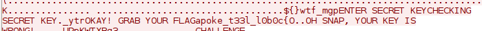

# Back again - Reversing 150

```
There are no disassemblers for this kind of program or this is what we think, can you proof otherwise?

Attachment
rev150_9f0cc9207d9c580d.zip
```

The same trick used in Old times worked here, too, except this time the bytes were scrambled around a bit. I just had to manually rearrange things with my eyeballs. Love when that happens. I didn't even have to go back in time to the 80's and ask the bank if I could borrow their AS/400.



`EKO{c0b0l_l33t_ekoparty_pgm_ftw}`

Surprisingly few people solved this, given that you could basically do this by dumping the file and eyeballing for strings.
