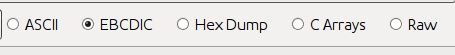
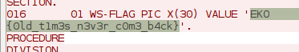

# Old times - Reversing 100

```
Grace Hopper will be proud of you! Don't let her down!

Attachment
rev100_62f48362bc4a0397.zip 
```

This one was a hacketedy hack in the truest sense. We're given some kind of save file from an IBM AS/400 system. The first thing I'd like to do is dig around w/ `strings`, `grep` or `xxd`, but it's probably EBCDIC-encoded, so I'll need a converter of some sort. This CTF was pretty good, so I just moved on to another problem rather than Googling for tools (booooring!).

I was using Wireshark for a different problem when I was reminded that its stream view can interpret streams as EBCDIC text.


*To get here, right click a TCP segment and select "Follow TCP stream." You can then choose to decode the stream in a handful of different ways, including EBCDIC.*

Using netcat, I sent the file to myself over the loopback interface, and sniffed the connection in Wireshark. Even when interpreted as EBCDIC, the file isn't plain text, but Wireshark's stream view gives us something quick and dirty:



Boom.
